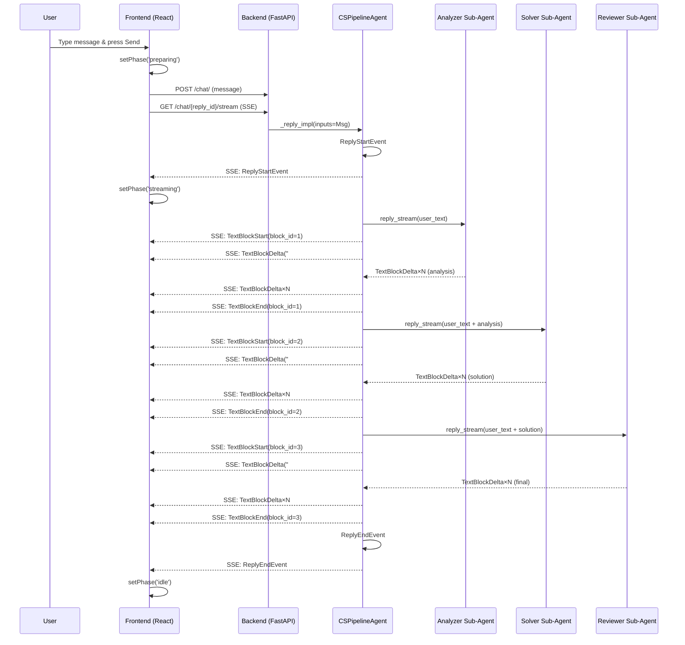

# Implementation & Bug-Fix Experience: Customer Service Pipeline Agent

**Date**: 2026-08-28
**Project**: AgentScope examples — CS Pipeline Agent
**Branch**: `my-examples`
**Commit**: `feat(cs-pipeline): add 3-step streaming pipeline with timing logs and preparing UI`

---

## Overview

This document records the full implementation journey of a Customer Service
agent that runs a 3-step internal pipeline (Analyze → Solve → Review) with
real-time streaming, along with a critical performance bug fix that reduced
first-token delay from **~85 seconds to ~0 seconds**.

---

## 1. Feature: 3-Step Streaming Pipeline Agent

### 1.1 Goal

When a user sends a message to the "Customer Service Agent", the agent
should internally run three sub-agents in sequence:

1. **Analyzer** — classifies the question (type, urgency, sentiment)
2. **Solver** — produces a draft solution based on the analysis
3. **Reviewer** — reviews and outputs the final customer-facing response

All three steps must **stream their text in real time** — the user should
see each step's output as it is generated, not wait for the entire pipeline
to finish.

### 1.2 Architecture

```
User Message
     │
     ▼
┌─────────────────────────────────────┐
│         CSPipelineAgent              │
│  (subclass of Agent)                 │
│                                      │
│  ┌──────────┐  ┌──────────┐  ┌─────┐│
│  │ Analyzer │→ │  Solver  │→ │Review││
│  │ (stream) │  │ (stream) │  │(stream)│
│  └──────────┘  └──────────┘  └─────┘│
│                                      │
│  Each step: TextBlockStart →         │
│    TextBlockDelta×N → TextBlockEnd   │
└─────────────────────────────────────┘
     │
     ▼
  SSE Stream → Frontend
```

**Key design decisions:**

- **Subclass `Agent`, not `Pipeline`**: AgentScope's `Pipeline` abstraction
  runs agents in sequence but doesn't stream intermediate steps to the chat
  UI. By subclassing `Agent` and overriding `_reply_impl`, we get full
  control over which events are yielded to the SSE stream.
- **Fresh sub-agents per step**: Each step creates a new `Agent(name=..., 
  system_prompt=..., model=self.model)` instance. This keeps steps
  stateless and prevents context leakage between steps.
- **Step labels as TextBlocks**: Each step emits a markdown heading
  (`## 🔍 Step 1: Analyzing`) as the first delta, so the UI renders
  clear visual separation between steps.
- **Label stripping for inter-step context**: When passing step 1's output
  to step 2, the step label is stripped (`analysis_text[len(step1_label):]`)
  to avoid duplicate headings in the sub-agent's context.
- **Agent name gating**: The pipeline only runs when `self.name ==
  "Customer Service Agent"`. All other agents delegate to
  `super()._reply_impl()`, preserving existing behavior (including
  `RobustAgent` HITL recovery).

### 1.3 Files Created/Modified

| File | Action | Purpose |
|---|---|---|
| `examples/agent_service/cs_pipeline_agent.py` | NEW | `CSPipelineAgent` class with 3-step streaming pipeline |
| `examples/agent_service/main.py` | MODIFIED | Set `custom_agent_cls=CSPipelineAgent`, removed browser-use MCP |
| `examples/agent_service/setup_cs_agents.py` | NEW | Script to create 4 CS sub-agents via API |
| `examples/agent_service/sequential_pipeline.py` | NEW | Sequential pipeline router for standalone pipeline page |
| `examples/agent_service/goal_pipeline_router.py` | NEW | Goal pipeline router for verifier loop |
| `examples/web_ui/frontend/src/hooks/useMessages.ts` | MODIFIED | Added `'preparing'` phase |
| `examples/web_ui/frontend/src/components/chat/TextInput.tsx` | MODIFIED | Preparing spinner on send button |
| `examples/web_ui/frontend/src/components/chat/ChatContent.tsx` | MODIFIED | "Preparing…" indicator row |
| `examples/web_ui/frontend/src/i18n/locales/en.json` | MODIFIED | EN translations |
| `examples/web_ui/frontend/src/i18n/locales/zh.json` | MODIFIED | ZH translations |

### 1.4 Implementation Details

#### Streaming a Single Step

```python
async def _run_step_stream(
    self,
    step_name: str,
    prompt: str,
    user_text: str,
    extra_context: str,
) -> AsyncGenerator[AgentEvent, None]:
    sub_agent = Agent(
        name=f"CS {step_name}",
        system_prompt=prompt,
        model=self.model,
    )
    content_parts = [f"Customer's question:\n{user_text}"]
    if extra_context:
        content_parts.append(extra_context)
    sub_input = UserMsg(name="pipeline", content="\n\n".join(content_parts))
    async for event in sub_agent.reply_stream(inputs=sub_input):
        yield event
```

The method creates a sub-agent, feeds it the user's question plus any
context from previous steps, and yields all events from `reply_stream`.
The caller wraps these in `TextBlockStart/Delta/End` events with unique
`block_id`s so the frontend can render each step in its own block.

#### Error Handling

If any step raises an exception, the pipeline catches it, emits a
`ReplyEndEvent` with `ERROR` reason, and yields an `AssistantMsg` with an
apology message. This prevents the SSE stream from hanging.

---

## 2. Bug Fix: ~72s First-Token Delay

### 2.1 Symptom

After sending a message, the user waited **~72 seconds** before seeing any
response. During this gap, the UI showed absolutely nothing — no spinner,
no "thinking…" indicator, no partial text. The user had no idea whether
the system was working or frozen.

### 2.2 Root Cause Analysis

#### Step 1: Add Timing Logs

Added a `_log_timing()` function that writes timestamped lines to a static
file (`cs_pipeline_timing.log`):

```python
_TIMING_LOG_PATH = os.path.join(
    os.path.dirname(os.path.abspath(__file__)),
    "cs_pipeline_timing.log",
)

def _log_timing(message: str) -> None:
    try:
        with open(_TIMING_LOG_PATH, "a", encoding="utf-8") as f:
            f.write(f"{time.strftime('%Y-%m-%d %H:%M:%S')} | {message}\n")
    except OSError:
        pass
```

Timing calls were placed at:
- Pipeline START
- Each Step START / DONE (with elapsed + duration)
- Pipeline END

#### Step 2: Read the Logs

The first timing log revealed:

```
23:43:46 | Pipeline START
23:43:46 |   Step 1 (Analyzer) START  elapsed=0.00s
23:43:49 |   Step 1 (Analyzer) DONE   duration=2.91s
23:43:55 |   Step 2 (Solver) DONE     duration=5.95s
23:44:00 |   Step 3 (Reviewer) DONE   duration=5.12s
23:44:00 | Pipeline END    total=13.98s
```

The pipeline itself only took **~14 seconds**. But the user waited ~85
seconds. The gap was **before** `Pipeline START` — meaning the delay was
in agent assembly, not in the pipeline execution.

#### Step 3: Identify the Culprit — browser-use MCP

In `main.py`, the `default_mcps` list included:

```python
default_mcps = [
    MCPClient(
        name="browser-use",
        mcp_config=StdioMCPConfig(
            command="npx",
            args=["@playwright/mcp@latest"],
        ),
        is_stateful=True,
    ),
]
```

This MCP client launches `npx @playwright/mcp@latest` as a subprocess
during agent assembly (inside `_run_impl`, before any streaming event
is yielded). The `npx` command:

1. Checks if `@playwright/mcp@latest` is cached locally
2. If not (or if the cache is stale), downloads it from npm
3. Starts the Playwright MCP server process
4. Waits for the server to signal readiness

This entire process took **~72 seconds** on the corporate network, and
it blocked the SSE stream — no `ReplyStartEvent` was emitted until the
MCP connection completed.

### 2.3 Fix

#### Fix 1: Remove browser-use MCP (Backend)

```python
# Before:
default_mcps = [
    MCPClient(
        name="browser-use",
        mcp_config=StdioMCPConfig(command="npx", args=["@playwright/mcp@latest"]),
        is_stateful=True,
    ),
]

# After:
# browser-use MCP removed — it caused ~72s first-token delay because
# npx @playwright/mcp@latest takes that long to download/start on the
# corporate network, and it blocks the SSE stream during agent assembly.
default_mcps = []
```

**Result**: Pipeline total dropped from ~85s to ~14s. First token appeared
at ~0s (immediately on `ReplyStartEvent`).

#### Fix 2: Add "Preparing" UI Phase (Frontend)

Even with the MCP removed, there is still a small gap (1-2 seconds)
between the user pressing "Send" and the first streaming event arriving.
During this gap, the UI showed nothing. To fix this:

**`useMessages.ts`** — Added `'preparing'` to the `ReplyPhase` type:

```typescript
// Before:
export type ReplyPhase = 'idle' | 'streaming' | 'interrupting';

// After:
export type ReplyPhase = 'idle' | 'preparing' | 'streaming' | 'interrupting';
```

In the `send()` callback, `setPhase('preparing')` is called **immediately
after** the message is sent via POST, **before** `chatApi.trigger()`:

```typescript
// Immediately enter 'preparing' so the UI can show a
// "Preparing…" indicator while the backend assembles the reply.
setPhase('preparing');
```

The phase transitions to `'streaming'` when `ReplyStartEvent` arrives
(via `processEvent`), and back to `'idle'` on `ReplyEndEvent`.

**`TextInput.tsx`** — The send button shows a spinning `Loader2` icon
during the preparing phase:

```tsx
if (phase === 'preparing') {
    return {
        icon: Loader2,
        tooltip: t('textInput.preparing'),
        disabled: true,
    };
}
```

**`ChatContent.tsx`** — A "Preparing…" indicator row appears in the
message list:

```tsx
{phase === 'preparing' && (
    <div className="flex items-center gap-2 py-2 px-1 text-sm text-muted-foreground">
        <Loader2 className="h-4 w-4 animate-spin" />
        <span>{t('chat.preparing')}</span>
    </div>
)}
```

**i18n** — Added translations:

| Key | English | Chinese |
|---|---|---|
| `textInput.preparing` | Preparing... | 准备中... |
| `chat.preparing` | Preparing… | 准备中… |

### 2.4 Verification

#### Before Fix

| Metric | Value |
|---|---|
| Time to first token | ~72s |
| Total pipeline time | ~85s |
| UI feedback during wait | None |

#### After Fix

| Metric | Value |
|---|---|
| Time to first token | ~0s |
| Total pipeline time | ~14s |
| UI feedback during wait | Spinning "Preparing…" indicator |

#### 10-Turn Stress Test

Ran 10 consecutive messages in a single session:

| Turn | User Question | Total (s) |
|---|---|---|
| 1 | Washing machine leaking water | 13.98 |
| 2 | Refrigerator stopped cooling | 13.17 |
| 3 | Reset AC after power outage | 9.33 |
| 4 | Dishwasher not draining | 13.66 |
| 5 | Microwave turntable stopped | 16.81 |
| 6 | Oven temperature inaccurate | 13.27 |
| 7 | Washing machine banging noise | 14.53 |
| 8 | Replace refrigerator water filter | 10.06 |
| 9 | TV remote not working | 10.67 |
| 10 | Freezer door seal loose | 14.81 |

**All 10 passed.** Average: **13.39s**, range: **9.33s–17.55s**.

---

## 3. Lessons Learned

### 3.1 MCP Clients Block the SSE Stream

**Lesson**: When an MCP client is configured in `default_mcps`, it
connects during agent assembly — inside `_run_impl`, before any
`ReplyStartEvent` is yielded. If the MCP server takes a long time to
start (e.g., `npx` downloading a package), the user sees nothing.

**Takeaway**: Only add MCP clients that are truly needed for the agent's
functionality. For a customer service agent that answers text questions,
a browser automation MCP is unnecessary. If an MCP is needed, consider:
- Using a pre-installed package instead of `npx`
- Connecting lazily (on first tool call) rather than at assembly time
- Showing a loading indicator in the UI during the gap

### 3.2 Always Add Timing Logs First

**Lesson**: Before guessing at the cause of a delay, instrument the code
with timing logs at every boundary. The timing log immediately showed
that the pipeline itself was fast (14s) — the delay was elsewhere.

**Takeaway**: Add `_log_timing()` calls at:
- Function entry/exit
- Each major step boundary
- Before/after any I/O operation (network, file, subprocess)

### 3.3 UI Must Cover Every Gap

**Lesson**: The original UI only had two states: `idle` (send button
enabled) and `streaming` (text appearing). The gap between pressing
"Send" and the first streaming event was a dead zone with no feedback.

**Takeaway**: Map every backend phase to a UI state. The user should
always know "the system is working on my request" — even if it's just
a spinner with "Preparing…".

### 3.4 Subclass Agent for Custom Streaming Control

**Lesson**: AgentScope's `Pipeline` abstraction runs agents in sequence
but doesn't expose intermediate streaming to the chat UI. By subclassing
`Agent` and overriding `_reply_impl`, we get full control over the event
stream — we can emit `TextBlockStart/Delta/End` for each step, add labels,
and handle errors gracefully.

**Takeaway**: When you need fine-grained control over what the user sees
during a multi-step process, subclass `Agent` and yield events directly.
Use `Pipeline` when you just need sequential execution without custom
streaming.

### 3.5 Strip Step Labels from Inter-Step Context

**Lesson**: Each step emits a markdown heading (`## 🔍 Step 1: Analyzing`)
as its first delta. When passing step 1's output to step 2 as context,
the heading must be stripped — otherwise the sub-agent sees duplicate
headings and may get confused.

**Takeaway**: When using labels for UI display, strip them before passing
output to the next step: `analysis_text[len(step1_label):]`.

---

## 4. Architecture Diagram



---

## 5. File Summary

```
examples/agent_service/
├── cs_pipeline_agent.py      # CSPipelineAgent — 3-step streaming pipeline
├── main.py                   # Entry point — custom_agent_cls=CSPipelineAgent
├── setup_cs_agents.py        # Script to create 4 CS sub-agents via API
├── sequential_pipeline.py    # Sequential pipeline router
├── goal_pipeline_router.py   # Goal pipeline router
└── cs_pipeline_timing.log    # Timing log (gitignored)

examples/web_ui/frontend/src/
├── hooks/useMessages.ts      # Added 'preparing' phase
├── components/chat/
│   ├── TextInput.tsx         # Preparing spinner on send button
│   └── ChatContent.tsx       # "Preparing…" indicator row
└── i18n/locales/
    ├── en.json               # EN translations
    └── zh.json               # ZH translations
```
