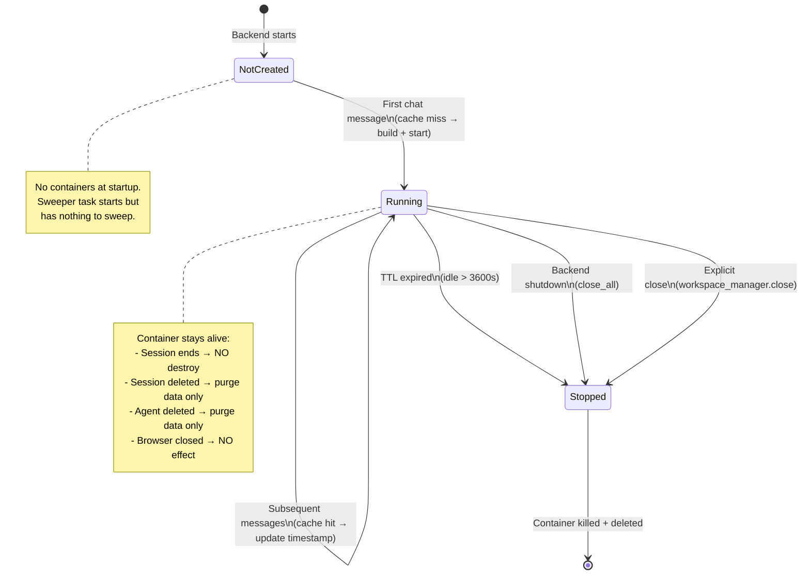

# Docker Workspace Container Lifecycle

## Overview

The Docker workspace container is managed by
`DockerWorkspaceManager`, which uses a **lazy-init + TTL-based
eviction** model. Containers are **not** created at backend startup,
and they are **not** destroyed when a chat session ends. Instead, they
live in an in-memory cache with a configurable idle timeout.

---

## 1. When Is the Container Started?

A container is started in exactly **one** situation:

### Trigger: First chat message in a session (cache miss)

```
User sends chat message
  → ChatService.run() calls workspace_manager.get_workspace()
  → DockerWorkspaceManager checks the in-memory cache
  → Cache MISS (first time for this workspace_id)
  → _build_and_start() is called:
      1. Image cache check (skip build if tag exists)
      2. Container created via containers.create_or_replace()
      3. Container started via container.start()
      4. MCP gateway launched inside container
      5. Workspace cached with current timestamp
  → Container is now running
```

**Key code path** (`_docker_workspace_manager.py`):

```python
async def get_workspace(self, user_id, agent_id, session_id, workspace_id):
    # 1. Check cache
    cached = self._cache.get(workspace_id)
    if cached is not None:
        # Cache HIT — update last-access timestamp, return
        self._cache[workspace_id] = (ws, time.monotonic())
        return ws

    # 2. Cache MISS — build and start container
    ws = await self._build_and_start(workspace_id=workspace_id, ...)
    self._cache[workspace_id] = (ws, time.monotonic())
    return ws
```

### What does NOT start a container?

| Action | Starts container? | Why |
|--------|:-:|-----|
| Backend startup | ❌ | `__aenter__` only starts the sweeper task, no containers |
| Frontend page open | ❌ | No backend call to `get_workspace` |
| Agent list loaded | ❌ | Reads from Redis storage, no workspace access |
| Session created | ❌ | Session creation stores a `workspace_id` but doesn't call `get_workspace` |
| Model selected | ❌ | No workspace access |
| **First chat message sent** | ✅ | `ChatService.run()` calls `get_workspace()` → cache miss → container starts |
| Second chat message (same session) | ❌ | Cache hit — container already running |
| Chat message in different session, same agent | ❌ | Same `workspace_id` (PER_AGENT isolation) — cache hit |

### The `workspace_id` determines container sharing

The `IsolationPolicy` controls whether sessions share a container:

| Policy | workspace_id | Container sharing |
|--------|-------------|-------------------|
| `PER_SESSION` | Fresh UUID per session | Each session gets its own container |
| `PER_AGENT` (default) | Deterministic hash of (user, agent) | All sessions of the same (user, agent) share one container |
| `PER_USER` | Deterministic hash of (user) | All sessions of the same user share one container |

With the default `PER_AGENT` policy, if user "inner" chats with the
"Customer Service Agent" in session A, then creates session B and chats
again, **both sessions use the same container** — the second session
gets a cache hit.

---

## 2. When Is the Container Destroyed?

A container is destroyed in **three** situations:

### Situation A: TTL Eviction (idle timeout)

```
Background sweeper wakes up every sweep_interval (default: 300s / 5 min)
  → Checks every cached workspace
  → If last_access + ttl < now (default ttl: 3600s / 1 hour):
      → Remove from cache
      → Call workspace.close():
          1. Close MCP gateway facade
          2. Call _teardown_backend():
              a. chown -R host_uid:host_gid /workspace (restore ownership)
              b. container.kill()
              c. container.delete(force=True)
              d. Close aiodocker client
  → Container is now gone
```

**Key code** (`_sweep_once`):

```python
async def _sweep_once(self):
    now = time.monotonic()
    expired_ids = [
        wid for wid, (_, ts) in self._cache.items()
        if now - ts > self._ttl  # default: 3600 seconds
    ]
    evicted = [self._cache.pop(wid)[0] for wid in expired_ids]
    await asyncio.gather(
        *(self._safe_close(ws) for ws in evicted),
        return_exceptions=True,
    )
```

**Important**: Every `get_workspace()` call updates the `last_access`
timestamp. So as long as the user keeps chatting, the container stays
alive. It only gets evicted after **1 hour of no activity**.

### Situation B: Backend Shutdown

```
Backend process receives SIGTERM / SIGINT / Ctrl+C
  → FastAPI lifespan shutdown
  → AsyncExitStack tears down in reverse order
  → workspace_manager.__aexit__():
      1. Stop prewarm buffer
      2. Cancel sweeper task
      3. Call close_all():
          → For every cached workspace in parallel:
              → workspace.close() (kill + delete container)
  → ALL containers are destroyed
```

**Key code** (`__aexit__`):

```python
async def __aexit__(self, *exc):
    await self._stop_prewarm()
    if self._sweep_task is not None:
        self._sweep_task.cancel()
        await self._sweep_task
    await self.close_all()  # kills + deletes ALL containers
```

### Situation C: Session/Agent Deletion (does NOT destroy container)

When a session or agent is deleted, the container is **NOT** destroyed.
Only the session's data inside the workspace is purged:

```
User deletes session
  → SessionService.delete_session()
  → workspace.purge_session():
      → Close session's MCP instances
      → Delete sessions/<session_id>/ directory inside /workspace
  → Container stays running (if other sessions use it)
```

```
User deletes agent
  → SessionService.delete_agent()
  → For each session: delete_session() → purge_session()
  → workspace.purge_agent():
      → Delete agent's skill partition
  → Container stays running (TTL eviction will clean it up later)
```

### What does NOT destroy a container?

| Action | Destroys container? | Why |
|--------|:-:|-----|
| Session ends (chat completes) | ❌ | No `close()` call — container stays in cache |
| Session deleted | ❌ | Only `purge_session()` — cleans session data, not container |
| Agent deleted | ❌ | Only `purge_agent()` — cleans agent data, not container |
| User closes browser tab | ❌ | No backend call |
| User navigates away | ❌ | No backend call |
| **1 hour of inactivity** | ✅ | TTL sweeper evicts idle container |
| **Backend shutdown** | ✅ | `close_all()` kills every container |
| **Explicit `close(workspace_id)`** | ✅ | Manual eviction (not exposed via API currently) |

---

## 3. Full Lifecycle Diagram



---

## 4. What Happens When a Container Is Restarted?

If a container was evicted (TTL or shutdown) and the user sends a new
chat message, `get_workspace()` finds a cache miss and calls
`_build_and_start()` again:

1. **Image cache check**: The image tag (`agentscope-workspace:<hash>`)
   already exists → **skip build** (cache hit)
2. **Container creation**: `containers.create_or_replace()` creates a
   new container with the same name (`as_ws_<workspace_id>`)
3. **Bind-mount**: The same host directory
   (`workspaces/<workspace_id>`) is mounted to `/workspace`
4. **Data persistence**: Because the bind-mount is read-write, all
   files in `/workspace` (sessions, skills, data, `.mcp`) **survive**
   the container restart

```
Container destroyed → workspace files persist on host
New chat message → new container created → same files mounted back
```

---

## 5. Summary Table

| Event | Container Created? | Container Destroyed? | Workspace Data |
|-------|:-:|:-:|:-:|
| Backend starts | ❌ | ❌ | N/A |
| Session created | ❌ | ❌ | N/A |
| **First chat message** | ✅ | ❌ | Initialized |
| Subsequent messages | ❌ (cache hit) | ❌ | Updated |
| Chat completes | ❌ | ❌ | Preserved |
| Session deleted | ❌ | ❌ | Session dir purged |
| Agent deleted | ❌ | ❌ | Agent skills purged |
| Browser closed | ❌ | ❌ | Preserved |
| **1 hour idle** | ❌ | ✅ (TTL) | Preserved (bind-mount) |
| **Backend shutdown** | ❌ | ✅ (all) | Preserved (bind-mount) |
| **New chat after eviction** | ✅ (re-created) | ❌ | Restored (bind-mount) |

---

## 6. Configuration Parameters

| Parameter | Default | Location | Description |
|-----------|---------|----------|-------------|
| `ttl` | `3600.0` (1 hour) | `DockerWorkspaceManager.__init__` | Seconds before idle container is evicted |
| `sweep_interval` | `300.0` (5 min) | `DockerWorkspaceManager.__init__` | How often the sweeper checks for expired containers |
| `isolation` | `PER_AGENT` | `WorkspaceManagerBase.__init__` | Workspace sharing: `PER_SESSION`, `PER_AGENT`, or `PER_USER` |
| `prewarm` | `None` | `DockerWorkspaceManager.__init__` | Keep N containers pre-built and idle for instant assignment |

These are set in `examples/agent_service/main.py`:

```python
workspace_manager = DockerWorkspaceManager(
    basedir=...,
    default_mcps=default_mcps,
    skill_paths=[...],
    # ttl=3600.0,          # default: 1 hour
    # sweep_interval=300.0, # default: 5 minutes
    # isolation=IsolationPolicy.PER_AGENT,  # default
)
```
